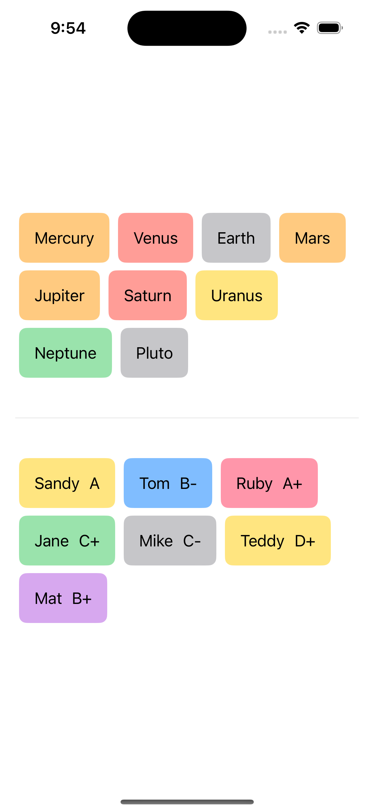
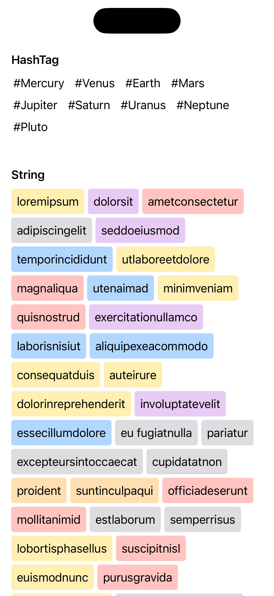

 # SDFlowLayout

SDFlowLayout is a fluid FlowLayout created with SwiftUI. This package is designed for iOS 14 and allows you to easily implement a GridView with flexible widths.


## Requirements

iOS 14.0  
macOS 11.0  

## Features

- Supports a GridView with flexible widths.
- Easily customizable using SwiftUI views.
- Compatible with various data collections.

## Installation
You can install this package using Swift Package Manager. Add the following dependency to your Package.swift file:
### Swift Package Manager

```swift
/// Package.swift
/// ...
dependencies: [
    .package(url: "https://github.com/sanhee16/SDFlowLayout.git", branch: "main"),
]
/// ...
```
 
## Usage  

Here’s a simple example of how to use SDFlowLayout:
```swift
import SwiftUI
import SDFlowLayout


struct ContentView: View {
    private let colors: [Color] = [.red, .blue, .green, .orange, .pink, .yellow, .gray, .purple]
    @StateObject private var vm: ContentVM = ContentVM()
    
    var body: some View {
        VStack {
            SDFlowLayout(data: vm.items1, id: \.self) { item in
                Text(item)
                    .padding()
                    .background(
                        RoundedRectangle(cornerRadius: 8)
                            .foregroundColor(self.colors.randomElement()?.opacity(0.5))
                    )
                    .padding(.trailing, 5)
            }
            
            Divider()
                .padding(.vertical, 30)
            
            SDFlowLayout(data: vm.items2, id: \.self) { item in
                peopleView(item)
                    .padding(.trailing, 5)
            }
        }
        .padding()
    }
    
    private func peopleView(_ item: People) -> some View {
        HStack(alignment: .center, spacing: 0, content: {
            Text("\(item.name)")
                .padding(.trailing, 10)
            Text(item.grade)
        })
        .padding()
        .background(
            RoundedRectangle(cornerRadius: 8)
                .foregroundColor(self.colors.randomElement()?.opacity(0.5))
        )
    }
}

struct People: Equatable, Hashable {
    var name: String
    var age: Int
    var grade: String
}

class ContentVM: ObservableObject {
    @Published var items1: [String] = ["Mercury",  "Venus", "Earth", "Mars", "Jupiter",  "Saturn", "Uranus", "Neptune", "Pluto"]
    @Published var items2: [People] = [
        People(name: "Sandy", age: 24, grade: "A"),
        People(name: "Tom", age: 24, grade: "B-"),
        People(name: "Ruby", age: 24, grade: "A+"),
        People(name: "Jane", age: 24, grade: "C+"),
        People(name: "Mike", age: 24, grade: "C-"),
        People(name: "Teddy", age: 24, grade: "D+"),
        People(name: "Mat", age: 24, grade: "B+"),
    ]
}
```
 

### Parameters
- data: The collection of data to display.
- id: A key path to identify each data item.
- content: A closure that generates a view for each data item.


## Contributing
If you would like to contribute, please fork this repository and submit a pull request.


## Author

sanhee16, sinhioa20@gmail.com
